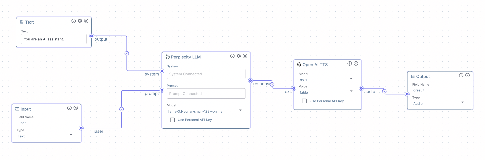

# Query to Audio Data

This script takes a user query, sends it to an Vectorshift API, and saves the returned audio-related data.

The API is accessing a Vectorshift pipeline such as:



## Setup

1. Ensure you have Python 3.7+ installed on your system.

2. Clone this repository:
   ```
   git clone <repository-url>
   cd query-to-audio
   ```

3. Install the required dependencies:
   ```
   make
   ```

4. Make sure your Vectorshift API key is setup as an environment variable.
   ```
   QUERY_TO_AUDIO_API_KEY=your_api_key_here
   ```

## Usage

Run the script with:

```
./venv/bin/python3 query_to_audio.py
```

You will be prompted to enter your query. After entering the query, the script will send it to the API, receive a response containing audio-related data, and save it as 'output_audio.wav' in the current directory and play it.

## Example

```bash
❯ ./venv/bin/python3 query_to_audio.py 
Enter your query: Who killed the Calydonian boar?
Audio data saved as output_audio.wav
Input #0, wav, from '/var/folders/cq/lhlr_ykn5l123vlq84c24fvm0000gn/T/tmpglwlmodx.wav':
  Duration: 00:00:12.36, bitrate: 384 kb/s
  Stream #0:0: Audio: pcm_s16le ([1][0][0][0] / 0x0001), 24000 Hz, 1 channels, s16, 384 kb/s
  12.24 M-A:  0.000 fd=   0 aq=    0KB vq=    0KB sq=    0B 
```